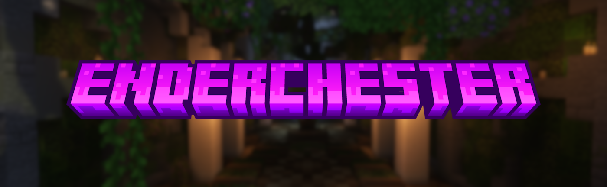

---

<h1 style="text-align:center;">Enderchester</h1>

<p style="text-align:center;">
    <a href="https://github.com/milkdrinkers/Enderchester/blob/main/LICENSE">
        
    </a>
    <a href="https://github.com/milkdrinkers/Enderchester/releases">
        
    </a>
    
    <a href="https://github.com/milkdrinkers/Enderchester/issues">
        
    </a>
    
    <a href="https://discord.gg/cG5uWvUcM6">
        
    </a>
</p>

This plugin is a tiny quality of life addition to Minecraft. It allows players to open their ender chest by holding one in their hand and right-clicking, or right-clicking one in their inventory.

---

## 🌟 Features

- Right-click Enderchest in the player hand to open.
- Right-click Enderchests in inventories to open.
- Highly configurable!
- Permissions support.
- Supports Minecraft 1.19+ (_The plugin is tiny and is unlikely to break due to Minecraft updates_)
- Developer API


---

## 📦 Downloads

<a href="https://github.com/milkdrinkers/Enderchester/releases/latest">
    
</a>
<a href="https://www.spigotmc.org/resources/121384/">
    
</a>
<a href="https://modrinth.com/plugin/enderchester/">
    
</a>
<a href="https://hangar.papermc.io/darksaid98/Enderchester/">
    
</a>

### Stable Releases

Stable releases can be downloaded from the platforms linked above.

### Pre-Releases

Pre-releases/release-candidates are denoted by having `RC` in the name. These releases are made ahead of stable releases and should not be considered entirely stable.

### Experimental Builds

Experimental builds/snapshots are denoted by having `SNAPSHOT` in the name and should be considered unstable. These are bleeding edge builds produced from the latest available code. We do not recommend running these in production environments as these builds are unfinished and may contain serious issues.

---

## 🤝 Bugs & Feature Requests

If you happen to find any bugs or wish to request a feature, please open an issue on our [issue tracker here](https://github.com/milkdrinkers/Enderchester/issues). We provide bug report and feature request templates, so it is important that you fill out all the necessary information.

Making your issue easy to read and follow will usually result in it being handled faster. Failure to provide the requested information in an issue may result in it being closed.

---

## 🚧 API

<a href="https://javadoc.io/doc/io.github.milkdrinkers/enderchester">
    
</a>

We provide API for developers accessible on [Maven Central Repository](https://central.sonatype.com/artifact/io.github.milkdrinkers/enderchester). 

<details>
<summary>Gradle Kotlin DSL</summary>

```kotlin
repositories {
    mavenCentral()
}

dependencies {
    compileOnly("io.github.milkdrinkers:enderchester:VERSION")
}
```
</details>

<details>
<summary>Maven</summary>

```xml
<project>
    <dependencies>
        <dependency>
            <groupId>io.github.milkdrinkers</groupId>
            <artifactId>enderchester</artifactId>
            <version>VERSION</version>
            <scope>provided</scope>
        </dependency>
    </dependencies>
</project>
```
</details>

---

## 🔧 Contributing

Contributions are always welcome! Please make sure to read our [Contributor's Guide](CONTRIBUTING.md) for standards and our [Contributor License Agreement (CLA)](CONTRIBUTOR_LICENSE_AGREEMENT.md) before submitting any pull requests.

We also ask that you adhere to our [Contributor Code of Conduct](CODE_OF_CONDUCT.md) to ensure this community remains a place where all feel welcome to participate.

---

## 📝 Licensing

You can find the license the source code and all assets are under [here](../LICENSE). Additionally, contributors agree to the Contributor License Agreement \(*CLA*\) found [here](CONTRIBUTOR_LICENSE_AGREEMENT.md).

---

## ❤️ Acknowledgments

- **[Artillex-Studios:](https://github.com/Artillex-Studios)** _For their excellent plugin [__AxShulkers__](https://github.com/Artillex-Studios/AxShulkers/), which this was inspired by. I highly recommend their plugin providing excellent QoL features for shulkers._

---

